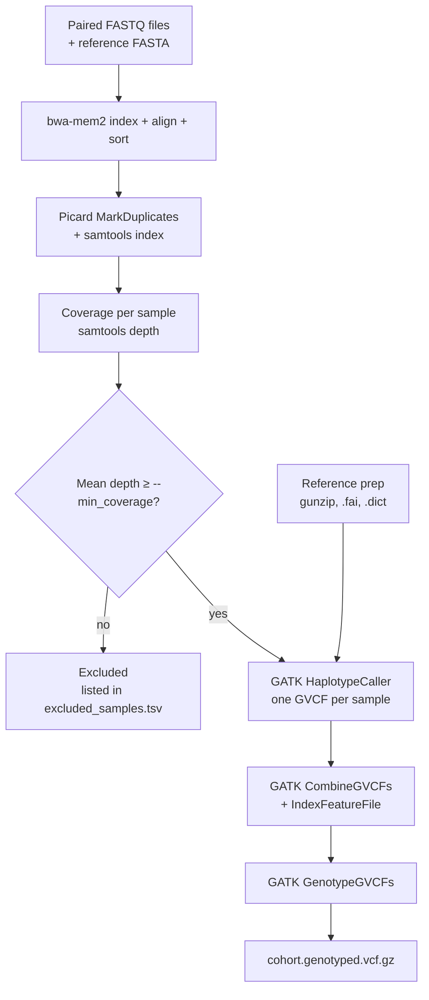

# MycoPops

**Population genomics of fungal whole-genome resequencing data.**

MycoPops is a [Nextflow](https://www.nextflow.io/) pipeline that takes paired-end Illumina reads from many fungal isolates and turns them into a single, jointly genotyped VCF file that is ready for population genetics analyses (PCA, ADMIXTURE, phylogenetics and so on).

It aligns reads to a reference genome, marks duplicates, measures coverage, **automatically removes low-coverage samples**, calls variants per sample with GATK HaplotypeCaller (haploid by default) and finally genotypes all samples together.

It was built from the bash scripts in [WPM_population_analysis](https://github.com/fc87290118/WPM_population_analysis) and is set up to run on the **Pawsey Setonix** supercomputer, although it can run on any Linux machine with Nextflow and Singularity or Docker.

---

## Contents

1. [What the pipeline does](#1-what-the-pipeline-does)
2. [What you need before you start](#2-what-you-need-before-you-start)
3. [Running on Pawsey Setonix (step by step)](#3-running-on-pawsey-setonix-step-by-step)
4. [Running on another computer](#4-running-on-another-computer)
5. [The sample sheet](#5-the-sample-sheet)
6. [Parameters](#6-parameters)
7. [Output files](#7-output-files)
8. [Coverage filtering](#8-coverage-filtering)
9. [Changing resources and tool settings](#9-changing-resources-and-tool-settings)
10. [Troubleshooting](#10-troubleshooting)
11. [Software versions](#11-software-versions)
12. [Credits](#12-credits)

---

## 1. What the pipeline does



| Step | Tool | What it does |
|------|------|--------------|
| 1 | bwa-mem2 index | Indexes the reference genome (done automatically, once) |
| 2 | bwa-mem2 mem + samtools sort | Aligns each sample's reads and sorts the BAM |
| 3 | Picard MarkDuplicates + samtools index | Flags PCR/optical duplicates and indexes the BAM |
| 4 | samtools stats (`COVERAGE_STATS`) | Quick coverage estimate: mapped reads × read length ÷ genome size |
| 5 | samtools depth (`GENOME_COVERAGE`) | Accurate mean depth and breadth from the aligned bases (duplicates excluded) |
| 6 | `COVERAGE_FILTER` | Removes samples below `--min_coverage` (default 20×) from all later steps |
| 7 | gunzip, samtools faidx, GATK CreateSequenceDictionary | Prepares the reference files GATK needs |
| 8 | GATK HaplotypeCaller | Calls variants per sample in GVCF mode (`-ERC GVCF -ploidy 1`) |
| 9 | GATK CombineGVCFs + IndexFeatureFile | Merges all sample GVCFs into one cohort GVCF |
| 10 | GATK GenotypeGVCFs | Joint genotyping of all samples (`--max-alternate-alleles 4`) |

You do not need to install any of these tools. Nextflow downloads a ready-made container for each one the first time it is used.

---

## 2. What you need before you start

**Data**

- **Paired-end FASTQ files** for each sample: one R1 and one R2 file. Compressed (`.fastq.gz`) or uncompressed (`.fastq`) both work. Trimming beforehand (for example with fastp) is recommended.
- **A reference genome** in FASTA format (`.fa`, `.fasta` or `.fna`). It can be gzipped (`.gz`); the pipeline decompresses it for GATK automatically. You do **not** need to index it yourself.
- **The genome size** in base pairs (see [how to find it](#how-to-find-the-genome-size)).

**Software** (already available on Pawsey)

- Nextflow version 23.04 or newer (the pipeline is tested with 25.04.6)
- Singularity (or Docker on a personal computer)
- git (to download the pipeline)

**On Pawsey you also need**

- A Pawsey account and a project with compute time (for example `pawsey1142`)

### How to find the genome size

Run this on your reference file and use the number it prints:

```bash
# for a gzipped reference
zcat reference.fna.gz | grep -v ">" | tr -d '\n' | wc -c

# for an uncompressed reference
grep -v ">" reference.fasta | tr -d '\n' | wc -c
```

---

## 3. Running on Pawsey Setonix (step by step)

This section walks through a full run on Setonix. Commands you type are shown in grey boxes. Replace anything in `<angle brackets>` with your own values.

### Some Pawsey background first

Setonix has several storage areas. Using the right one matters:

| Location | Shortcut | Use it for | Watch out for |
|----------|----------|-----------|---------------|
| `/home/<username>` | `$HOME` | Nothing big. Only small settings files | Very small quota (about 1 GB). Never run the pipeline here |
| `/scratch/<project>/<username>` | `$MYSCRATCH` | **Running the pipeline**: input data, work files and results | Files not read or modified for **21 days are deleted automatically** |
| `/software/projects/<project>/<username>` | `$MYSOFTWARE` | Installed software | Quota on size and number of files |
| Acacia | | Long-term storage of results | Needs its own setup (see Pawsey docs) |

> **Rule of thumb:** download the pipeline and run it from `$MYSCRATCH`, then copy the results you want to keep to Acacia when the run is finished.

Setonix uses the **Slurm** job scheduler. You never run heavy work on the login node. Instead you submit one small "head" job that runs Nextflow, and Nextflow submits every pipeline step as its own Slurm job.

### Step 1: Log in

```bash
ssh <username>@setonix.pawsey.org.au
```

### Step 2: Go to your scratch folder and download the pipeline

```bash
cd $MYSCRATCH
git clone https://github.com/KristinaGagalova/MycoPops.git
cd MycoPops
```

Everything from now on happens inside this `MycoPops` folder.

### Step 3: Put your data on scratch

Copy (or download) your FASTQ files and reference genome somewhere under `$MYSCRATCH`, for example:

```
/scratch/<project>/<username>/pop_data/reads/       <- FASTQ files
/scratch/<project>/<username>/pop_data/reference/   <- reference FASTA
```

### Step 4: Make the sample sheet

The sample sheet is a CSV file listing every sample and where its two FASTQ files are. See [section 5](#5-the-sample-sheet) for the full format.

If your files are named like `SAMPLE_1.fastq.gz` and `SAMPLE_2.fastq.gz`, this builds the sheet for you. Adjust `READS` and the two endings to match your files:

```bash
READS=/scratch/<project>/<username>/pop_data/reads
R1_END=_1.fastq.gz
R2_END=_2.fastq.gz

echo "sample,fastq_1,fastq_2" > samplesheet.csv
for r1 in "$READS"/*"$R1_END"; do
    sample=$(basename "$r1" "$R1_END")
    r2="${r1%$R1_END}$R2_END"
    echo "$sample,$(realpath "$r1"),$(realpath "$r2")" >> samplesheet.csv
done

# check it
head samplesheet.csv
wc -l samplesheet.csv    # number of samples + 1 header line
```

> **Tip:** for your first run, keep only 2 or 3 samples in the sheet. That lets you check everything works before spending compute time on hundreds of samples.

### Step 5: Edit the run script

Open `run_mycopops.sbatch` in a text editor (for example `nano run_mycopops.sbatch`). It looks like this:

```bash
#!/usr/bin/bash --login

#SBATCH --nodes=1
#SBATCH --ntasks=1
#SBATCH --cpus-per-task=4
#SBATCH --mem=10GB
#SBATCH --partition=work
#SBATCH --time=1-00:00:00
#SBATCH --account=pawsey1142
#SBATCH --mail-type=ALL
#SBATCH --export=NONE

module load nextflow/25.04.6
module load singularity/4.1.0-slurm

REF=/path/to/your/reference.fna.gz

nextflow run ./main.nf \
    --input samplesheet.csv \
    --fasta $REF \
    --genome_size 140000000 \
    --outdir ./results \
    -profile pawsey_setonix,singularity \
    -resume
```

Change these lines (and nothing else is needed):

1. `--account=` to your Pawsey project code
2. `REF=` to the full path of your reference genome
3. `--genome_size` to your genome size in base pairs
4. Optionally add `--min_coverage <number>` (default 20) or `--ploidy <number>` (default 1). See [section 6](#6-parameters).

> **Careful with the backslashes.** Each line of the `nextflow run` command except the last ends with ` \` (a space and a backslash), which tells bash the command continues on the next line. Do not put anything after the backslash, not even a space or a comment.

> The `#SBATCH` settings at the top are only for the small head job that runs Nextflow. The resources for the actual analysis steps are set in `nextflow.config` (see [section 9](#9-changing-resources-and-tool-settings)).

> If the `module load` lines fail, check which versions exist with `module avail nextflow` and `module avail singularity`, and update the lines.

### Step 6: Submit the run

```bash
sbatch run_mycopops.sbatch
```

Slurm prints a job number, for example `Submitted batch job 12345678`.

The first run takes longer because the software containers are downloaded (into a `singularity_cache` folder inside `MycoPops`). Later runs reuse them.

### Step 7: Follow the progress

```bash
# your jobs in the queue (the head job plus the steps Nextflow submitted)
squeue -u $USER

# the pipeline's live progress (replace with your job number)
tail -f slurm-12345678.out        # press Ctrl+C to stop watching

# the detailed log, useful when something goes wrong
less .nextflow.log
```

The progress lines look like this. Each line is one step; `✔` means finished:

```
[9d/aaa4f8] POP…:GATK4_HAPLOTYPECALLER (sample1) | 2 of 2 ✔
```

To stop a run, cancel the head job with `scancel <job number>`. Nextflow then stops the jobs it submitted.

### Step 8: If the run stops, just submit it again

Runs can stop because a step ran out of memory or time, or because the head job reached its own time limit (24 hours in the script above; large cohorts can take longer than that).

Fix the cause if there is one (see [Troubleshooting](#10-troubleshooting)), then submit the same script again:

```bash
sbatch run_mycopops.sbatch
```

Because the script uses `-resume`, Nextflow skips every step that already finished and continues where it stopped. **Do not delete the `work` folder** if you want to resume.

### Step 9: Check the results

When the run finishes, `slurm-<job number>.out` ends with a summary and `Succeeded`. Your results are in `results/` ([section 7](#7-output-files) explains every file). Good first things to look at:

```bash
# which samples passed or failed the coverage filter
cat results/coverage/coverage_filter_report.tsv

# samples that were excluded and why
cat results/coverage/excluded_samples.tsv

# the final genotyped VCF
ls -lh results/genotyping/cohort.genotyped.vcf.gz
```

`results/pipeline_info/report.html` shows how long each step took and how much memory it used. Download it to your computer and open it in a web browser.

### Step 10: Save your results and clean up

Remember that `/scratch` is purged after 21 days without access. Copy what you want to keep (at least `results/genotyping/`, `results/coverage/` and `results/pipeline_info/`) to Acacia or your institution's storage. See Pawsey's [Acacia guides](https://pawsey.atlassian.net/wiki/display/US/Common+Usage) for how to set up and copy data to Acacia.

Once you are sure you no longer need to resume the run, free up space:

```bash
rm -rf work/                       # Nextflow's working files (often very large)
rm -rf results/bwamem_mapping/     # intermediate BAMs; the final BAMs are in results/markdup/
```

### Pawsey-specific notes

- **Partitions and time limits.** Setonix's `work` partition allows jobs up to 24 hours. The `long` partition allows up to 96 hours, but only 4 jobs per user can run on it at once. The `pawsey_setonix` profile automatically sends any step that asks for more than 24 hours to `long`. For example, if you raise the time for GenotypeGVCFs to `72h` it moves to `long` without any other change.
- **Head job time.** The head job must stay alive for the whole run. If your cohort takes more than a day, either resubmit with `-resume` whenever it stops (Step 8), or give the head job more time by changing it to `#SBATCH --partition=long` and `#SBATCH --time=4-00:00:00`.
- **Where jobs are charged.** Steps are charged to your default Pawsey project (`$PAWSEY_PROJECT`). If you belong to several projects, check it with `echo $PAWSEY_PROJECT`.
- **Service units.** Setonix charges by core-hours (1 SU = 1 core for 1 hour), and jobs asking for a lot of memory are charged for the matching share of a node. Per-sample steps run once for every sample, so their CPU settings matter most for your total cost (see [section 9](#9-changing-resources-and-tool-settings)).
- **Queue size.** The profile lets Nextflow have at most 50 jobs in the queue at once, so a large cohort is processed in waves.
- **Launch folder.** Nextflow creates its `work` folder, and the `singularity_cache` folder, inside the folder you launch from. This is another reason to always launch from `$MYSCRATCH`.

---

## 4. Running on another computer

On a Linux machine or another cluster with Nextflow installed, run the pipeline directly with a container profile:

```bash
nextflow run main.nf \
    --input samplesheet.csv \
    --fasta /path/to/reference.fna.gz \
    --genome_size 140000000 \
    --outdir ./results \
    -profile singularity \
    -resume
```

Use `-profile docker` instead of `singularity` if you have Docker. Note that the default resources in `nextflow.config` expect a large machine (for example 32 GB of memory for alignment and 64 GB for joint genotyping). On a smaller computer, lower them with a custom config (see [section 9](#9-changing-resources-and-tool-settings)).

---

## 5. The sample sheet

A CSV file with a header line and one line per sample:

```csv
sample,fastq_1,fastq_2
isolate_01,/scratch/pawsey1142/me/reads/isolate_01_1.fastq.gz,/scratch/pawsey1142/me/reads/isolate_01_2.fastq.gz
isolate_02,/scratch/pawsey1142/me/reads/isolate_02_1.fastq.gz,/scratch/pawsey1142/me/reads/isolate_02_2.fastq.gz
```

| Column | What to put |
|--------|-------------|
| `sample` | A unique name for the sample. Use letters, numbers, `_` and `-` only (no spaces). This name appears in every output file and in the final VCF |
| `fastq_1` | Full path to the R1 (forward) FASTQ file |
| `fastq_2` | Full path to the R2 (reverse) FASTQ file |

Rules:

- Column names must be exactly `sample,fastq_1,fastq_2`.
- Use **full paths** (starting with `/`), not relative ones.
- Every sample name must be unique.
- The pipeline stops at the start if a FASTQ file does not exist, which catches typos early.
- A tab-separated file also works if you add `--manifest_sep '\t'`.

---

## 6. Parameters

Parameters are added to the `nextflow run` command with two dashes, for example `--min_coverage 15`.

| Parameter | Required? | Default | Description |
|-----------|-----------|---------|-------------|
| `--input` | **yes** | | Path to the sample sheet |
| `--fasta` | **yes** | | Path to the reference genome FASTA (can be `.gz`) |
| `--genome_size` | **yes** | | Genome size in base pairs, used by the quick coverage estimate. See [how to find it](#how-to-find-the-genome-size) |
| `--outdir` | no | `./results` | Folder for the results |
| `--min_coverage` | no | `20` | Minimum mean depth (×) a sample needs to go on to variant calling. `0` keeps every sample that has any coverage |
| `--ploidy` | no | `1` | Ploidy given to HaplotypeCaller. `1` = haploid, right for most fungal isolates |
| `--manifest_sep` | no | `,` | Separator in the sample sheet. Use `'\t'` for tab-separated |

Nextflow's own options use a **single** dash:

| Option | What it does |
|--------|--------------|
| `-profile` | Where and how to run. On Setonix use `pawsey_setonix,singularity`. Elsewhere use `singularity` or `docker` |
| `-resume` | Reuse finished steps from a previous run |
| `-c <file>` | Load an extra config file, for example to change resources |

---

## 7. Output files

Everything is written to the folder given by `--outdir` (default `results/`):

```
results/
├── bwamem_index/            bwa-mem2 index of the reference
├── bwamem_mapping/          sorted BAM per sample, before duplicate marking (intermediate)
│   └── <sample>.bam
├── markdup/                 final BAMs, use these for any further BAM analysis
│   ├── <sample>.markdup.bam
│   ├── <sample>.markdup.bam.bai
│   └── <sample>.markdup.metrics.txt      duplication rate per sample
├── coverage/
│   ├── coverage_summary.tsv              quick estimate, all samples
│   ├── genome_coverage_summary.tsv       accurate depth and breadth, all samples
│   ├── coverage_filter_report.tsv        PASS / FAIL per sample
│   ├── excluded_samples.tsv              samples removed, with the reason
│   └── <sample>.*.tsv                    per-sample versions of the above
├── reference/
│   ├── <reference>.fai                   FASTA index
│   └── <reference>.dict                  sequence dictionary
├── haplotypecaller/
│   ├── <sample>.g.vcf.gz                 per-sample GVCF
│   └── <sample>.g.vcf.gz.tbi
├── genotyping/
│   ├── cohort.combined.g.vcf.gz(.tbi)    all GVCFs merged
│   └── cohort.genotyped.vcf.gz(.tbi)     FINAL jointly genotyped VCF
└── pipeline_info/
    ├── report.html                       run time and memory per step
    ├── timeline.html
    ├── trace.txt
    └── dag.html                          diagram of the pipeline
```

**The main result is `genotyping/cohort.genotyped.vcf.gz`.** It contains every sample that passed the coverage filter and is the starting point for filtering (for example SNP selection, biallelic filtering and missingness filters) and population analyses.

### The coverage files explained

`genome_coverage_summary.tsv` is the one to trust:

| Column | Meaning |
|--------|---------|
| `sample` | Sample name |
| `genome_length` | Reference length in bp (read from the BAM) |
| `aligned_bases` | Number of aligned bases after removing duplicates |
| `mean_depth` | Average depth across the whole genome (this is what the filter uses) |
| `breadth_1x_pct` | Percent of the genome covered by at least one read |

`coverage_summary.tsv` (no header; columns: sample, mapped reads, genome size, coverage) is a quicker estimate that also counts duplicate reads, so it is usually higher than `mean_depth`.

---

## 8. Coverage filtering

Samples with low coverage give unreliable genotypes, so after measuring coverage the pipeline keeps only samples whose `mean_depth` is **at least** `--min_coverage` (default 20×). Samples with no coverage at all (for example if nothing aligned) are always removed.

- Removed samples are still aligned and their BAMs stay in `markdup/`, so you can inspect them.
- They are **not** passed to HaplotypeCaller or genotyping, and do not appear in the final VCF.
- The reasons are listed in `coverage/excluded_samples.tsv` and printed as warnings in the log.
- If every sample is removed, the pipeline still finishes but produces no VCF. Check `excluded_samples.tsv` and consider a lower threshold.

To change the threshold, add for example `--min_coverage 15` to the `nextflow run` command and resubmit with `-resume`. Only the steps after the filter are re-run.

---

## 9. Changing resources and tool settings

### Resources (CPUs, memory, time)

The resources for each step are in the `process { }` block of `nextflow.config`:

| Step | CPUs | Memory | Time |
|------|------|--------|------|
| `BWAMEM2_INDEX` | 4 | 32 GB | 2 h |
| `BWAMEM2_MEM` | 16 | 32 GB | 8 h |
| `PICARD_MARKDUPLICATES` | default | 32 GB | default |
| `GATK4_HAPLOTYPECALLER` | 24 | 24 GB | 12 h |
| `GATK4_COMBINEGVCFS` | 24 | 16 GB | 24 h |
| `GATK4_GENOTYPEGVCFS` | 24 | 64 GB | 24 h |

The GATK and Picard steps give Java 80% of the memory you set.

The safest way to change these is a small config file of your own, so `nextflow.config` stays untouched. For example, to give joint genotyping three days, create `my_resources.config`:

```groovy
process {
    withName: 'GATK4_GENOTYPEGVCFS' {
        time = '72h'
    }
}
```

and add `-c my_resources.config` to the `nextflow run` line. On Setonix this step then goes to the `long` partition automatically.

Common situations:

- **A step failed with exit status 137.** It ran out of memory. Increase its `memory` and resubmit.
- **A step failed with exit status 140** (or the log mentions a time limit). It ran out of time. Increase its `time` and resubmit.
- **CombineGVCFs or GenotypeGVCFs is too slow for a big cohort.** These run as a single job for all samples. Giving them more time is the simplest fix.

### Tool settings

The options passed to each tool are in `conf/modules.config`:

| Step | Setting | Default |
|------|---------|---------|
| `BWAMEM2_MEM` | Read group added to each BAM | `-M -R "@RG\tID:<sample>\tSM:<sample>"` |
| `PICARD_MARKDUPLICATES` | Duplicate tagging | `--TAGGING_POLICY All` |
| `GENOME_COVERAGE` | Extra `samtools depth` filters, for example `'-Q 20'` for a minimum mapping quality | none |
| `GATK4_HAPLOTYPECALLER` | GVCF mode and ploidy | `-ERC GVCF -ploidy <--ploidy>` |
| `GATK4_GENOTYPEGVCFS` | Maximum alternate alleles | `--max-alternate-alleles 4` |

The output folders are set in `conf/containers.config`.

---

## 10. Troubleshooting

**`Missing required parameter: --input`** (or `--fasta`)
Add the missing parameter to the `nextflow run` command.

**`A process input channel evaluates to null -- Invalid declaration val genome_size`**
`--genome_size` is missing. Add it (see [how to find it](#how-to-find-the-genome-size)).

**`Invalid --min_coverage` or `Invalid --ploidy`**
The value must be a number (`--min_coverage` can be `0` or more; `--ploidy` must be a whole number, 1 or more).

**`... does not exist` for a FASTQ file**
A path in the sample sheet is wrong. Check it with `ls -l <path>` and use full paths.

**A step failed with exit status 137 or 140**
Out of memory (137) or out of time (140). See [section 9](#9-changing-resources-and-tool-settings), then resubmit.

**The head job stopped after 24 hours but steps were still running**
The head job reached its time limit. Submit the script again; `-resume` continues from where it stopped.

**`Disk quota exceeded`**
You are probably running from `$HOME`. Move the pipeline and data to `$MYSCRATCH` and run from there.

**Files or the `work` folder disappeared**
`/scratch` deletes files that have not been accessed for 21 days. Copy results you want to keep to Acacia soon after the run finishes.

**No `genotyping/` folder in the results**
Every sample was removed by the coverage filter. Check `results/coverage/excluded_samples.tsv`.

**The run is slow to start the first time**
The containers are being downloaded. This happens only once.

**Where to find the real error message**
The end of `slurm-<job number>.out` names the failed step and its work folder, for example `work/9d/aaa4f8...`. Inside that folder, `.command.err` and `.command.log` contain the tool's own error messages, and `.command.sh` shows the exact command that was run.

---

## 11. Software versions

Each step runs in its own container:

| Tool | Version |
|------|---------|
| bwa-mem2 | 2.2.1 (index), bwa-mem2 + samtools container (alignment) |
| Picard | 3.4.0 |
| samtools | 1.24 (indexing), 1.23.1 (coverage modules) |
| GATK | 4.7.0.0 (HaplotypeCaller, CreateSequenceDictionary), 4.6.2.0 (CombineGVCFs, IndexFeatureFile, GenotypeGVCFs) |
| Nextflow | 23.04 or newer (tested with 25.04.6) |

---

## 12. Credits

Pipeline by Dr Kristina Gagalova and Dr Grace Fang, adapted from the bash scripts by Grace Fang (Curtin University / Pawsey): https://github.com/fc87290118/WPM_population_analysis

Uses modules from [nf-core/modules](https://github.com/nf-core/modules).

## License

MIT
